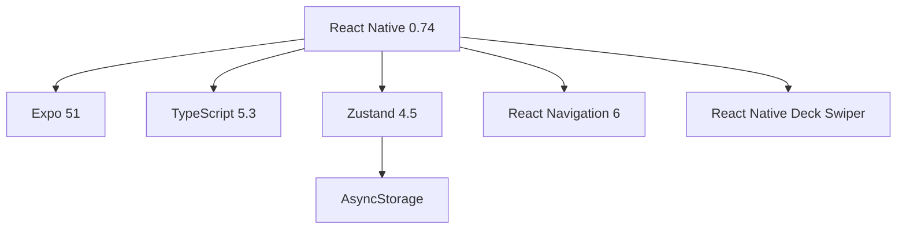

# Swiply 🃏

> Swipe right to like, swipe left to pass — discover amazing products in a fun, Tinder-like interface!

[](https://reactnative.dev)
[](https://expo.dev)
[](https://www.typescriptlang.org)
[](https://github.com/pmndrs/zustand)

## 📱 Screenshots

| Swipe Screen | Item Details | Seller Profile | Liked Items |
|--------------|--------------|----------------|-------------|
| (coming soon) | (coming soon) | (coming soon) | (coming soon) |

## ✨ Features

- **🃏 Tinder-like swiping** — Intuitive card-based interface for browsing products
- **❤️ Smart likes system** — Double swipe prevention, persistent storage with Zustand
- **🌓 Dark/Light theme** — System-aware theme switching with smooth transitions
- **👤 Seller profiles** — View seller ratings, response rates, and detailed info
- **📦 Rich product cards** — Full descriptions, delivery options, payment methods
- **💾 Persistent storage** — Liked items saved between sessions with AsyncStorage
- **🎯 Minimalist animations** — Subtle micro-interactions for better UX

## 🛠️ Tech Stack



### Core Technologies
- **React Native 0.74** + **Expo 51** — Cross-platform mobile development
- **TypeScript 5.3** — Type safety and better developer experience
- **Zustand 4.5** — Lightweight state management with persistence
- **Expo Router 3.5** — File-based navigation
- **React Native Deck Swiper** — Smooth card swiping animations

## 🏗️ Architecture

```
📦 src
├── 📱 app/                 # Expo Router pages
│   ├── 🏠 index.tsx        # Main swipe screen
│   ├── ❤️ likes.tsx        # Liked items
│   ├── 👤 profile.tsx      # User profile
│   ├── 📦 item/[id].tsx    # Product details
│   └── 🏪 seller/[id].tsx  # Seller profile
├── 🧩 components/           # Reusable components
│   ├── 🃏 Card.tsx         # Product card
│   ├── 🦶 GlobalFooter.tsx # Bottom navigation
│   └── 🎨 ThemeToggle.tsx  # Dark/light toggle
├── 🗂️ store/                # Zustand stores
│   └── 📋 useLikesStore.ts # Likes & history
├── 🎭 styles/               # Styling
│   ├── 🎨 colors.ts        # Theme colors
│   └── *.styles.ts         # Component styles
└── 📊 data/                 # Mock data
    └── 📁 items.ts          # Products & sellers
```

## 🚀 Getting Started

### Prerequisites
- Node.js 18+
- Expo CLI
- iOS Simulator / Android Emulator or physical device with Expo Go

### Installation

```bash
# Clone the repository
git clone https://github.com/yourusername/swiply.git

# Navigate to project
cd swiply

# Install dependencies
npm install

# Install iOS pods (if on macOS)
cd ios && pod install && cd ..

# Start the development server
npx expo start
```

Scan the QR code with **Expo Go** (Android) or **Camera** app (iOS) to run on your device.

## 🎯 Why Swiply?

Swiply transforms the boring e-commerce browsing experience into an engaging, game-like activity. Instead of endless scrolling through grids of products, users can quickly swipe through high-quality cards, making product discovery fast, fun, and addictive.

### Perfect for:
- 🛍️ **Marketplaces** looking to increase user engagement
- 🚀 **Startups** wanting to test product-market fit quickly
- 💼 **Freelancers** needing a modern, full-featured portfolio piece

## 🔮 Future Plans

### Backend Migration to Go 🚀

We're planning to scale Swiply with a high-performance backend:

```go
// Coming soon: Go microservices architecture
type SwiplyBackend struct {
    API        *gin.Engine
    PostgreSQL *gorm.DB
    Redis      *redis.Client
    Kafka      *kafka.Producer
}
```

**Planned tech stack:**
- **Golang** — Blazing fast performance with goroutines
- **PostgreSQL** — Robust relational data storage
- **GraphQL** — Flexible API layer
- **gRPC** — Efficient microservices communication
- **Docker + Kubernetes** — Scalable deployment

### Upcoming Features
- 🔐 **Authentication** — Sign in with Google/Apple
- 💬 **Real-time chat** — Between buyers and sellers
- 🗺️ **Geolocation** — Find products near you
- 📸 **Image upload** — Sellers can add multiple photos
- ⭐ **Reviews & ratings** — After purchase completion

## 🛡️ Security Features

Current security measures:
- ✅ Hermes bytecode compilation
- ✅ API keys protection with react-native-keys
- ✅ Code obfuscation
- ✅ RASP protection with freeRASP
- ✅ License and copyright protection

## 🤝 Contributing

Contributions are welcome! Feel free to:
- 🐛 Report bugs
- 💡 Suggest new features
- 🔧 Submit pull requests

## 📄 License

MIT License

Copyright (c) 2026 [Your Name]

Permission is hereby granted, free of charge, to any person obtaining a copy
of this software and associated documentation files (the "Software"), to deal
in the Software without restriction, including without limitation the rights
to use, copy, modify, merge, publish, distribute, sublicense, and/or sell
copies of the Software, and to permit persons to whom the Software is
furnished to do so, subject to the following conditions:

The above copyright notice and this permission notice shall be included in all
copies or substantial portions of the Software.

THE SOFTWARE IS PROVIDED "AS IS", WITHOUT WARRANTY OF ANY KIND, EXPRESS OR
IMPLIED, INCLUDING BUT NOT LIMITED TO THE WARRANTIES OF MERCHANTABILITY,
FITNESS FOR A PARTICULAR PURPOSE AND NONINFRINGEMENT. IN NO EVENT SHALL THE
AUTHORS OR COPYRIGHT HOLDERS BE LIABLE FOR ANY CLAIM, DAMAGES OR OTHER
LIABILITY, WHETHER IN AN ACTION OF CONTRACT, TORT OR OTHERWISE, ARISING FROM,
OUT OF OR IN CONNECTION WITH THE SOFTWARE OR THE USE OR OTHER DEALINGS IN THE
SOFTWARE.

---

<div align="center">
  <br>
  <sub>
    Built with 
     Neovim 
    on 
     macOS 
    with ❤️
  </sub>
  <br>
  <sub>✨ Happy Swiping! ✨</sub>
</div>
