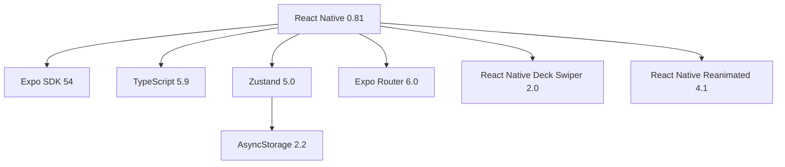

# Swiply

> Swipe right to like, swipe left to pass — discover products in a Tinder-like interface.

[](https://reactnative.dev)
[](https://expo.dev)
[](https://www.typescriptlang.org)
[](https://github.com/pmndrs/zustand)
[](https://github.com)

---

## What it does

Swiply turns product browsing into a card-swiping experience. Instead of scrolling through endless grids, users flip through rich product cards — swipe right to save, swipe left to skip. Fast, intuitive, and oddly satisfying.

## Screenshots

<div align="center">
  <table>
    <tr>
      <td align="center"><b>Swipe Screen</b></td>
      <td align="center"><b>Item Details</b></td>
      <td align="center"><b>Seller Profile</b></td>
      <td align="center"><b>Liked Items</b></td>
    </tr>
    <tr>
      <td></td>
      <td></td>
      <td></td>
      <td></td>
    </tr>
  </table>
</div>

## Features

- **Tinder-like swiping** — Card-based interface for browsing products
- **Smart likes system** — Double swipe prevention, persistent storage with Zustand
- **Dark / Light theme** — System-aware switching with smooth transitions
- **Seller profiles** — Ratings, response rates, and detailed info
- **Rich product cards** — Full descriptions, delivery options, payment methods
- **Persistent storage** — Liked items saved between sessions with AsyncStorage
- **Minimalist animations** — Subtle micro-interactions via Reanimated

## Stack



| | |
|---|---|
| Framework | React Native 0.81 + Expo SDK 54 |
| Language | TypeScript 5.9 |
| State | Zustand 5.0 + AsyncStorage |
| Navigation | Expo Router 6.0 |
| Animations | React Native Reanimated 4.1 |
| Gestures | React Native Gesture Handler 2.28 |
| Cards | React Native Deck Swiper 2.0 |

## Getting Started

### Prerequisites
- Node.js 18+
- Expo CLI
- iOS Simulator / Android Emulator or physical device with Expo Go

### Installation

```bash
# Clone the repository
git clone https://github.com/zokuuu/swiply.git
cd swiply

# Install dependencies
npm install

# Install iOS pods (macOS only)
cd ios && pod install && cd ..

# Start the development server
npx expo start
```

Scan the QR code with **Expo Go** (Android) or the **Camera** app (iOS).

## Project Structure

```
src/
├── app/                    # Expo Router pages
│   ├── index.tsx           # Main swipe screen
│   ├── likes.tsx           # Liked items
│   ├── profile.tsx         # User profile
│   ├── item/[id].tsx       # Product details
│   └── seller/[id].tsx     # Seller profile
├── components/
│   ├── Card.tsx            # Product card
│   ├── GlobalFooter.tsx    # Bottom navigation
│   └── ThemeToggle.tsx     # Dark/light toggle
├── store/
│   └── useLikesStore.ts    # Likes & history
├── styles/
│   ├── colors.ts           # Theme colors
│   └── *.styles.ts         # Component styles
└── data/
    └── items.ts            # Mock products & sellers
```

## Roadmap

- [ ] Authentication — Sign in with Google / Apple
- [ ] Real-time chat — Between buyers and sellers
- [ ] Geolocation — Find products near you
- [ ] Image upload — Multiple photos per listing
- [ ] Reviews & ratings — After purchase completion
- [ ] Go backend — High-performance API with PostgreSQL
- [ ] GraphQL API layer
- [ ] Docker + Kubernetes deployment

## License

MIT License — Copyright (c) 2026 Nikita Kasymov

---

<div align="center">
  <br>
  <sub>
    Built with
     macOS
    with ❤️
  </sub>
  <br>
  <sub>✨ Happy Swiping! ✨</sub>
</div>
